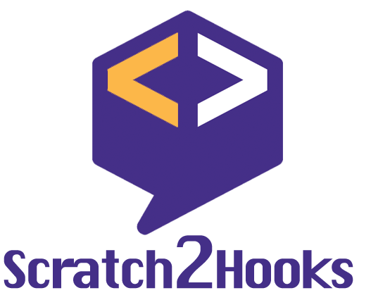

## Overview
Scratch2Hookks is a fork of [scratch-blocks](https://github.com/LLK/scratch-blocks) project that provides a design specification and codebase for building creative computing interfaces. 

We plan to build dedicated Programing blocks for smart contract development.

*This project is in active development *
